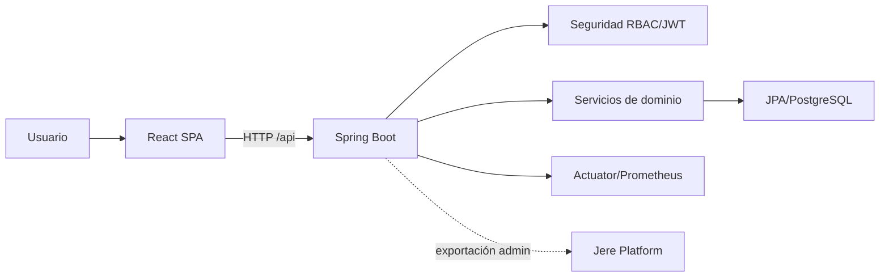

# Arquitectura

> Estado: PARCIAL  
> Última revisión: 2026-07-24  
> Fuentes principales: `backend/pom.xml`, `frontend/package.json`, `README.md`

## Estilo confirmado

Monorepo cliente-servidor. Backend REST modular con Spring Web, Security, Validation, JPA y PostgreSQL; frontend SPA React; operación con Docker Compose y PowerShell.

## Capas

Controladores → servicios/casos de uso → repositorios JPA → entidades. DTO y MapStruct forman límites de transporte. `TratadorDeErrores` centraliza errores HTTP.

## Transacciones

CONFIRMADO: la liquidación de cargos persiste snapshot en `cargo_liquidaciones` dentro de la misma transacción. PENDIENTE: inventario total de `@Transactional`.

## Riesgos estructurales

Contratos REST compartidos; rollback acoplado a Flyway; demo dependiente de metadata coherente; integración Jere Platform deshabilitada y sin push automático.