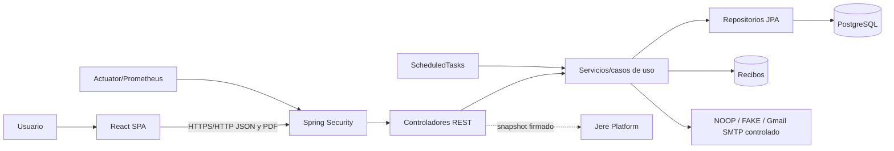

# Arquitectura

> Estado: CONFIRMADO  
> Última revisión: 2026-07-24  
> Fuentes principales: `../../AGENTS.md`, `../../backend/pom.xml`, `../../frontend/package.json`, código

## Estilo arquitectónico

Gestudio es un **monolito modular por capas** dentro de un monorepo. No es una implementación completa de arquitectura hexagonal ni Clean Architecture. La dirección histórica de `.kiro/steering/ARCHITECTURE.md` no autoriza una reescritura masiva.

```mermaid
flowchart LR
    U[Usuario] --> SPA[React SPA]
    SPA -->|HTTPS/HTTP JSON y PDF| SEC[Spring Security]
    SEC --> API[Controladores REST]
    API --> APP[Servicios/casos de uso]
    APP --> REPO[Repositorios JPA]
    REPO --> PG[(PostgreSQL)]
    APP --> FILES[(Recibos)]
    JOBS[ScheduledTasks] --> APP
    API -. snapshot firmado .-> JP[Jere Platform]
    APP --> MAIL[NOOP / FAKE / Gmail SMTP controlado]
    OBS[Actuator/Prometheus] --> SEC
```

## Capas implementadas

| Capa | Responsabilidad | Ubicación |
|---|---|---|
| Presentación web | Rutas, formularios, permisos visuales | `frontend/src` |
| Entrada HTTP | Validar requests y construir responses | `gestudio/controladores`, APIs especializadas |
| Aplicación | Orquestación, transacciones, reglas | `gestudio/servicios`, `tarifas/application`, `cuotas/application` |
| Persistencia | Entidades y consultas | `gestudio/entidades`, `repositorios`, persistencia especializada |
| Infraestructura | Seguridad, errores, config, archivos, observabilidad | `gestudio/infra` |
| Integración | Exportador Jere Platform y correo | `gestudio/integraciones`, `servicios/email` |

## Módulos por capacidad

- seguridad e identidad;
- alumnos, profesores, disciplinas, salones e inscripciones;
- asistencias;
- tarifas, condiciones, matrículas, mensualidades y cargos;
- pagos, créditos, caja y egresos;
- stock y ventas;
- recibos, reportes y notificaciones;
- integración Jere Platform;
- operación y recuperación.

Los límites son de paquete y responsabilidad, no procesos desplegables separados.

## Comunicación

- SPA ↔ backend: síncrona por REST.
- Backend ↔ PostgreSQL: síncrona mediante JPA/SQL.
- Jobs: invocación interna programada, sin broker.
- Jere Platform: endpoint pull/administrativo; Gestudio no hace push.
- Email: `IEmailService` selecciona por `app.email.provider`, con `NOOP` seguro
  en cualquier perfil. Gmail SMTP requiere guardas explícitas; la copia IMAPS
  opcional ocurre después de SMTP y nunca se trata como atómica.
- Observabilidad: endpoints Actuator; Prometheus protegido por token separado.

## Límites transaccionales

Las transacciones deben estar en el caso de uso. Flujos críticos mantienen consistencia entre pago, aplicaciones, caja, crédito, stock y recibo. La liquidación persiste cargo y snapshot histórico en la misma transacción. Side effects posteriores deben ejecutarse after-commit cuando corresponda.

## Procesamiento de errores

`TratadorDeErrores` normaliza 400, 401, 403, 404, 405, 409, 502 y 500 en `ApiErrorResponse`; sanitiza errores internos. Persisten excepciones legacy resueltas dentro de algunos controladores, por lo que no todos los endpoints son uniformes.

## Acoplamientos relevantes

- UI y backend comparten códigos de permiso.
- Contratos API son consumidos por formularios y tests.
- Rollback de imagen depende del historial Flyway aplicado.
- Recibos combinan DB y filesystem.
- Demo y CI comparan metadata Git, Compose y Flyway.
- El exportador Jere Platform depende de un contrato externo versionado.

## Restricciones arquitectónicas

No introducir microservicios, mensajería distribuida, CQRS global, event sourcing, modelos dominio/JPA duplicados para cada entidad ni interfaces especulativas. Interfaces sólo cuando existe una frontera real.
