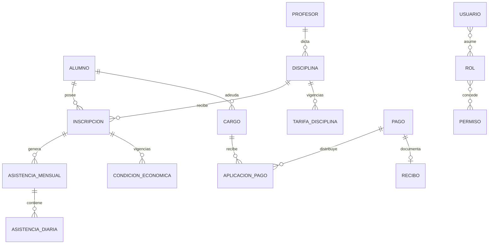

# Modelo de dominio

> Estado: PARCIAL  
> Última revisión: 2026-07-24  
> Fuentes principales: `../../backend/src/main/java/gestudio/entidades`, servicios, migraciones y controladores

## Agregados y conceptos

| Capacidad | Entidades/símbolos confirmados |
|---|---|
| Personas y oferta | `Alumno`, `Profesor`, `Disciplina`, `DisciplinaHorario`, `Salon` |
| Inscripción y asistencia | `Inscripcion`, `AsistenciaMensual`, `AsistenciaAlumnoMensual`, `AsistenciaDiaria` |
| Economía | `TarifaDisciplina`, `CondicionEconomicaInscripcion`, `Matricula`, `Mensualidad`, `Cargo`, liquidaciones |
| Cobranza | `Pago`, `AplicacionPago`, `MetodoPago`, `MovimientoCredito`, `Recibo`, `ReciboPendiente` |
| Caja e inventario | `MovimientoCaja`, `Egreso`, `MovimientoStock`, `VentaStock` |
| Configuración | `Concepto`, `SubConcepto`, `Bonificacion`, `Recargo` |
| Seguridad | `Usuario`, `Rol`, `Permiso`, `RefreshSession` |
| Comunicación | `Notificacion`, `ObservacionProfesor` |
| Integración | snapshots y páginas Jere Platform creados por V7 |

## Relaciones confirmadas o fuertemente evidenciadas

Las cardinalidades exactas deben verificarse en entidades y migraciones antes de modificar esquema.

## Reglas e invariantes críticas

### Finanzas

- Todo importe monetario usa `BigDecimal`, escala y redondeo explícitos.
- Una tarifa o condición se selecciona por fecha de vigencia.
- Un cargo conserva un snapshot inmutable de su liquidación.
- No usar descripciones legibles como claves foráneas.
- No aplicar más dinero que el saldo disponible.
- No silenciar sobrepagos ni saldos negativos.
- Pago, aplicaciones, crédito, caja y stock deben quedar consistentes.
- Anulación/reversión es una operación explícita; no se borra la historia.

### Datos históricos

No eliminar físicamente pagos, detalles, mensualidades, inscripciones, asistencias, movimientos de caja, egresos ni usuarios auditables. Preferir estados, baja lógica o registros compensatorios.

### Seguridad

- Usuario, rol y permiso deben estar activos.
- Los permisos de roles activos se agregan.
- `authVersion` invalida tokens anteriores.
- Toda capacidad funcional exige además `PERM_APP_ACCESO`.

### Tiempo

Fechas de negocio usan `Clock` configurable y `America/Argentina/Buenos_Aires`. Evitar `LocalDate.now()` disperso.

### Integración

`GESTUDIO_STUDENT` exporta únicamente `sourceId`, `displayName` y `active`; no exporta datos académicos ni financieros.

## Estados y transiciones relevantes

- Activo ↔ baja lógica para alumnos, profesores, disciplinas, stock y configuración.
- Pago/egreso/venta/crédito: creación → aplicación/efecto → anulación o reversión explícita.
- Refresh session: vigente → rotada/revocada; reutilización produce revocación.
- Snapshot Jere: creado de forma atómica → páginas recuperables e inmutables.

## Información pendiente

- Cardinalidades y cascadas completas.
- Enumeraciones exactas de estados financieros.
- Límites de agregado efectivos.
- Inventario de constraints e índices por entidad.
- Política de retención de snapshots, recibos y refresh sessions.
