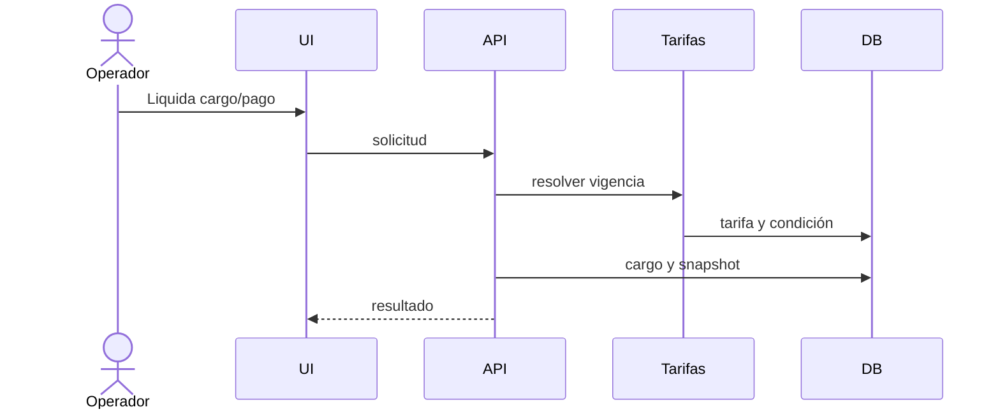

# Flujos funcionales

> Estado: PARCIAL  
> Última revisión: 2026-07-24  
> Fuentes principales: controladores backend, `README.md`, `scripts/`

## Autenticación/autorización

Credenciales llegan a `AutenticacionControlador`; backend emite/valida JWT y aplica permisos. Configuración o permiso ausente debe denegar.

## Alta e inscripción

Usuario autorizado crea/actualiza alumno y registra inscripción mediante `AlumnoControlador` e `InscripcionControlador`, servicios y repositorios asociados.

## Liquidación y pago

## Otros flujos

Asistencia diaria/mensual; caja e inventario; demo persistente; manual visual Playwright; backup/restore y rollback compatible con Flyway.