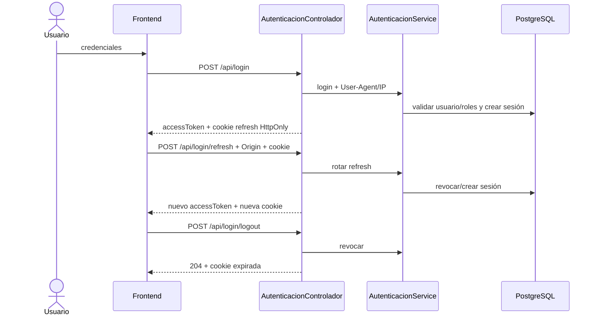
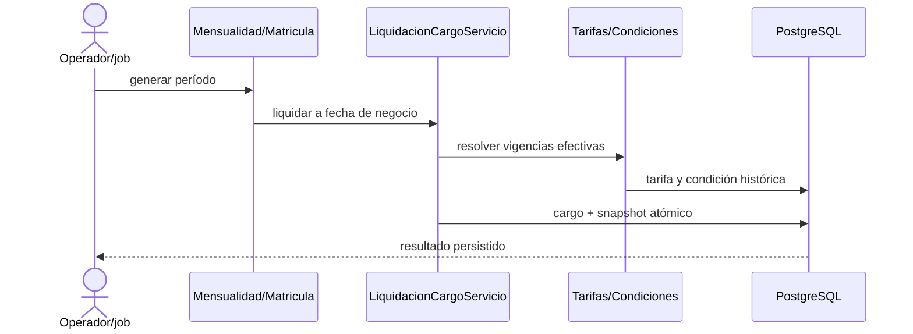

# Flujos funcionales

> Estado: CONFIRMADO  
> Última revisión: 2026-07-24  
> Fuentes principales: controladores, servicios, pruebas de seguridad, smoke y runbooks

## Login, refresh y logout

```mermaid
sequenceDiagram
    actor U as Usuario
    participant F as Frontend
    participant A as AutenticacionControlador
    participant S as AutenticacionService
    participant DB as PostgreSQL
    U->>F: credenciales
    F->>A: POST /api/login
    A->>S: login + User-Agent/IP
    S->>DB: validar usuario/roles y crear sesión
    A-->>F: accessToken + cookie refresh HttpOnly
    F->>A: POST /api/login/refresh + Origin + cookie
    A->>S: rotar refresh
    S->>DB: revocar/crear sesión
    A-->>F: nuevo accessToken + nueva cookie
    F->>A: POST /api/login/logout
    A->>S: revocar
    A-->>F: 204 + cookie expirada
```

Precondiciones: Origin permitido para refresh/logout, usuario activo y secretos válidos. Errores: 400 por validación, 401 por credenciales/token, 403 por Origin o permiso, 409 por reutilización de refresh.

## Alta e inscripción académica

1. Actor con `PERM_ALUMNOS_ADMIN` crea o modifica alumno.
2. Actor con `PERM_DISCIPLINAS_ADMIN` mantiene oferta y horarios.
3. Actor con `PERM_INSCRIPCIONES_ADMIN` crea inscripción por `alumnoId` y `disciplinaId`.
4. Constraint/servicio evita inscripción activa equivalente.
5. Se consultan relaciones alumno–disciplina y profesor–disciplina.

Componentes: `AlumnoControlador`, `InscripcionControlador`, `DisciplinaControlador`, servicios y repositorios correspondientes.

## Vigencias, mensualidad y cargo

```mermaid
sequenceDiagram
    actor O as Operador/job
    participant M as Mensualidad/Matricula
    participant L as LiquidacionCargoServicio
    participant T as Tarifas/Condiciones
    participant DB as PostgreSQL
    O->>M: generar período
    M->>L: liquidar a fecha de negocio
    L->>T: resolver vigencias efectivas
    T->>DB: tarifa y condición histórica
    L->>DB: cargo + snapshot atómico
    DB-->>O: resultado persistido
```

Si falta una vigencia verificable, la API responde conflicto `HISTORICAL_PRICING_NOT_DEFINED`.

## Pago y recibo

1. `POST /api/pagos` recibe alumno, método, monto, aplicaciones e idempotency key.
2. `PagoServicio` valida saldo, sobreaplicación y crédito.
3. Persiste pago, aplicaciones y movimientos relacionados de forma consistente.
4. Genera/persiste referencia de recibo.
5. `GET /api/pagos/recibo/{pagoId}` valida storage key y devuelve PDF.
6. La anulación usa `POST /api/pagos/{id}/anulacion`.

## Venta de stock

1. `POST /api/stocks/ventas` valida existencias y actor.
2. Descuenta stock, registra movimiento y genera `CargoResponse`.
3. `POST /api/stocks/ventas/{id}/reversion` compensa la operación.
4. Constraints impiden stock negativo.

## Asistencia

- Planilla mensual: listar/crear/actualizar por disciplina, mes y año.
- Detalle diario: registrar o actualizar por alumno/fecha.
- Job diario crea asistencias detalladas para inscripciones activas.
- Consultas relacionan planilla, disciplina y fecha.

## Cumpleaños

`NotificacionService.generarYObtenerCumpleanerosDelDia()` se invoca desde endpoint y job. La inserción/notificación se diseñó para evitar duplicados y usar fecha civil de Buenos Aires. El GET tiene comportamiento generativo, por lo que no es una lectura pura.

## Exportación Jere Platform

1. Actor con ambos permisos crea snapshot por POST.
2. Servicio materializa alumnos ordenados, serializa una vez, firma HMAC-SHA256 y persiste páginas.
3. Devuelve primera página y headers.
4. Receptor continúa por GET con checkpoint/cursor.
5. No existe push automático; el operador transporta los bytes exactos.

## Operación

Demo, certificación y manual visual están detallados en [28-demo-manual-and-certification.md](28-demo-manual-and-certification.md). Backup/restore y rollback están en [14-build-deployment-operations.md](14-build-deployment-operations.md).
